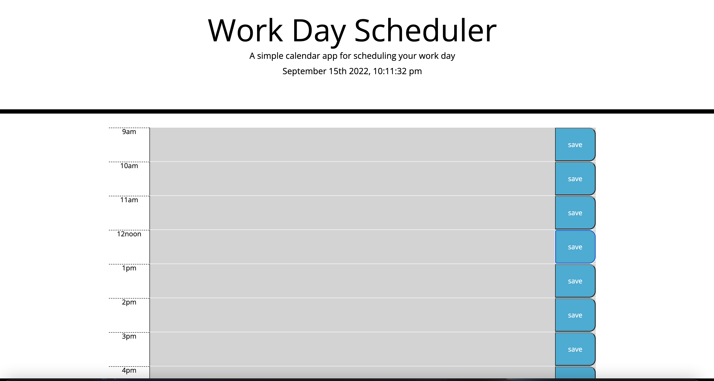
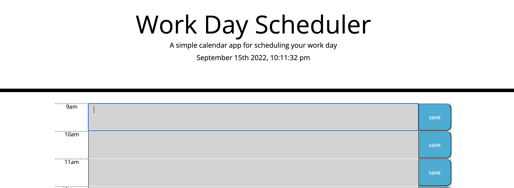

## time-hub

## Description
<a href="https://emsaw721.github.io/time-hub/"> Time Hub </a> is an application that allows the user to outline their daily tasks in an easy to read format. 

## Usage
Time Hub consists of editable time blocks from 9am to 5pm where the user can write and save their tasks for the workday. 

At first, the application user will see the opening page. 

Then, the user will click in the first time slot labelled "9am" in order to place his, her, or their tasks to be completed from 9am to 10am. 

The user will repeat the above for the times 10am - 5pm.  

A time block indicated in green means that is the current time, a block indicated in gray means the time has passed, and a block indicated in red means that time is yet to occur. 

## Roadmap
Future iterations of this app will provide personalization such as color, font size, font type, and 15 minute increments within each hour. 

## Authors and acknowledgment
This README was made possible by https://www.makeareadme.com/. 

## License
[MIT](https://choosealicense.com/licenses/mit/)

